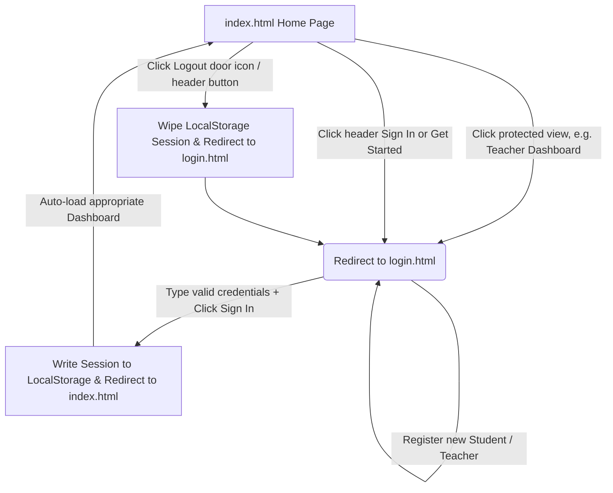

# Walkthrough - EduPredict AI Platform

I have successfully enhanced the EduPredict AI platform, separating the authentication features into a dedicated, standalone **Multi-Page Application (MPA)** login layout.

---

## 🚀 Responsive Multi-Page Auth Architecture

Here are the new files and their roles in this design:

### Standalone Page
- **[login.html](file:///c:/Users/keshr/Downloads/project/login.html)**: A separate, fully responsive webpage that displays a glassmorphic login panel. It handles Sign In and Create Account registrations in a completely isolated container. Built with responsive viewport breakpoints (looks gorgeous on mobile, tablet, and desktop).
- **[js/login.js](file:///c:/Users/keshr/Downloads/project/js/login.js)**: Holds the event listeners for form validation, dynamic student setup panels, tab toggling, and alerts rendering on the standalone page.

### Integrated Home Dashboard
- **[index.html](file:///c:/Users/keshr/Downloads/project/index.html)**: Cleaned up and removed the redundant inline authentication card wrapper.
- **[js/ui.js](file:///c:/Users/keshr/Downloads/project/js/ui.js)**: Upgraded the SPA view coordinator. 
  - **Redirect Protection**: Guests attempting to visit dashboard pages are automatically redirected to `login.html` instead of triggering modal alerts.
  - **Log In Action**: Redirects users to `login.html`.
  - **Log Out Action**: Destroys the database session state and redirects the browser back to `login.html`.

---

## 🛠️ Multi-Page Integration Flow

---

## 🎯 Verification & Testing Guide

Since this is a client-side multi-page application with a shared `LocalStorage` database core, you can verify it directly on your computer:

### 1. Launch the Main Portal
Open **[index.html](file:///c:/Users/keshr/Downloads/project/index.html)** in your browser. 
- Since you are initially not logged in (guest state), you can view the Landing Page, the Core Predictor slider, the DSA Playground, and the Viva Q&A Center.
- If you click **Teacher Dashboard** or **Student Directory** in the sidebar, or click **Get Started** / **Sign In**, the browser will automatically redirect your view to **[login.html](file:///c:/Users/keshr/Downloads/project/login.html)**.

### 2. Perform standalone login
On **[login.html](file:///c:/Users/keshr/Downloads/project/login.html)**:
- Select **Teacher Access** and type username: `teacher` | Password: `password`.
- Click **Sign In**.
- You will be redirected back to **[index.html](file:///c:/Users/keshr/Downloads/project/index.html)** and instantly routed into the **Teacher Dashboard** page showing active student registries, stat animations, and averages.

### 3. Log out and switch roles
- Click the door icon at the bottom of the sidebar (or the header **Logout** button).
- The browser will instantly wipe the active cookie state and redirect you to **[login.html](file:///c:/Users/keshr/Downloads/project/login.html)**.
- Switch to the **Create Account** tab, choose **Student Register**, register a new student (e.g. `Anjali Patel`), and click **Register**.
- Switch back to **Sign In**, select **Student Access**, type username `student` (or `Arjun Sharma`), and click **Sign In**.
- You will be redirected to the home page, and automatically routed to the personalized **Student Profile** dashboard!
